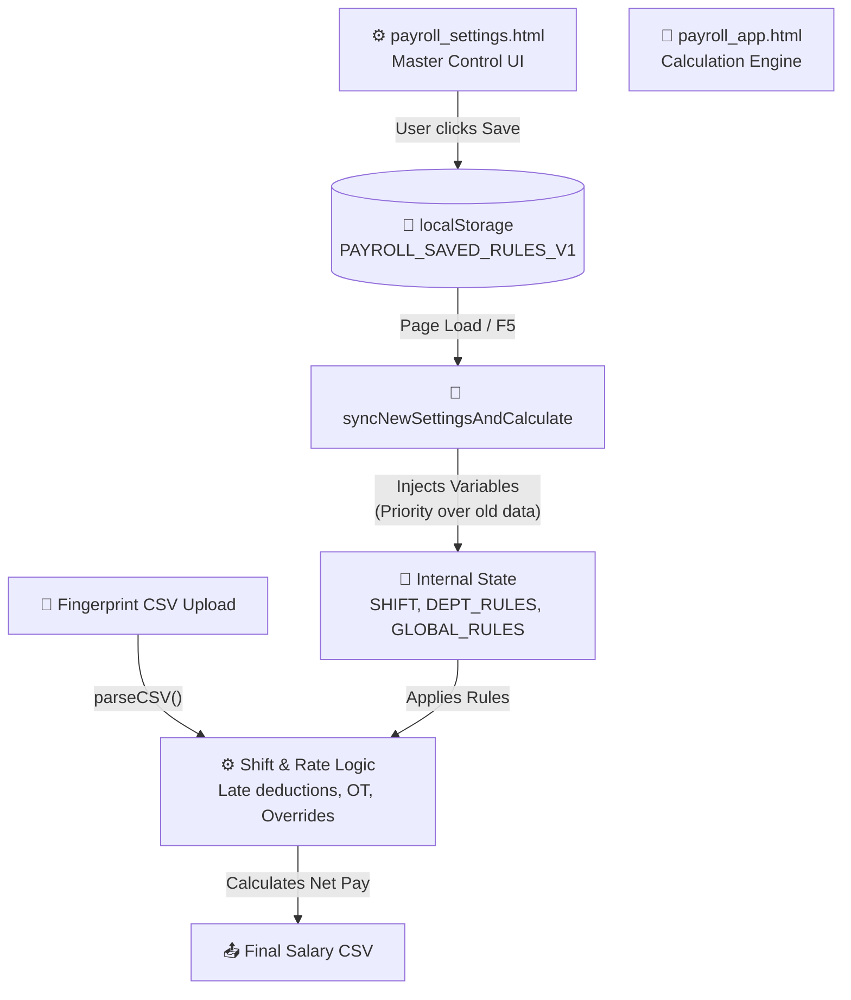

# 🏗️ Payroll System Architecture
**Path:** `c:\Users\Tmango\Desktop\เงินเดือน`

## 1. Core Components

The payroll system consists of three primary components that share business logic:
1. **Dynamic Frontend SPA** (`payroll_app.html`): The main calculation engine. Parses fingerprint CSVs, resolves shifts, calculates OT and late deductions, and allows manual overrides.
2. **Settings Configuration UI** (`payroll_settings.html`): The central "Master Control" interface where administrators configure global rules, employee shifts, OT policies, and rounding rules.
3. **Backend CLI Scripts** (`calc_salary.py`, `calc_salary.js`): Headless scripts used for terminal-based processing or validation.

## 2. Shared Data Structures (localStorage)

- **PAYROLL_SAVED_RULES_V1**: Master configuration JSON generated by `payroll_settings.html`. Contains `globalRules`, `shiftProfiles`, `shiftTemplates`, and `otDepartmentRules`.
- **RAW_PUNCHES**: Dynamic state object mapping `Employee ID` to daily punch records (from CSV upload).
- **EDITS**: Tracks manual administrative overrides (notes, custom amounts). Persisted as `PAYROLL_EDITS_202603`.
- **ADVANCES**: Tracks advance salary requests and payouts. Stored as `PAYROLL_ADVANCE_202603`. Each entry contains `{ date, amount, note }`. System enforces a guard: advance amount cannot exceed remaining net pay (`t.net`). Default date auto-sets to today (if within current month) or first day of the month.
- **ERRANDS**: Tracks personal errands or short leaves. Stored as `PAYROLL_ERRANDS_202603`. Each entry contains `{ date, start, end, mins, amount }`. Calculates exact per-minute deduction based on wages and shift templates, automatically mapping penalty into `r.deduct` alongside daily `r.note` logging.
- **Legacy Fallbacks**: `PAYROLL_SHIFT_202603` and `PAYROLL_DEPT_RULES_202603`. Used only if `PAYROLL_SAVED_RULES_V1` does not provide an override.

## 3. Data Flow & Execution Pipeline

1. **Configuration Sync (Page Load)**: `syncNewSettingsAndCalculate()` runs in `payroll_app.html`. It reads `PAYROLL_SAVED_RULES_V1` and instantly injects the latest rates, shift times, and calculation rules (grace minutes, rounding policies) into the core logic variables (`SHIFT`, `GLOBAL_RULES`, `DEPT_RULES`).
2. **Import Stage**: User selects a CSV file. The SPA uses dual-encoding detection (UTF-8/Windows-874) to parse punch records into `RAW_PUNCHES`.
3. **Shift Resolution Stage**: `getShift()` determines the correct shift (Dynamic Shift Detection), intentionally injecting the employee's base shift to prevent false "shift swap" detections. This stage also evaluates dynamic OT group upgrades (e.g., automatically promoting an employee with a `"none"` OT setup to `"morning"` equivalent OT if they cover a morning shift).
4. **Time Normalization**: Translates `HH:mm` strings to float hours. Handles overnight shifts (`cout += 24` if `cout < cin`).
5. **Rate & Deduction Logic**: Applies rule-based formatting: dynamic late deductions, OT eligibility, and rate downgrades. Future holidays (where the date is greater than today) are labeled "วันหยุดพักผ่อน (ล่วงหน้า)" and temporarily evaluate to 0 baht to prevent inappropriate advance withdrawals until the actual day arises.
6. **Calculation & Rendering**: Calculates the final net pay and renders the Accordion UI. 
7. **All-in-One Backup System**: State can be exported and imported directly inside `payroll_app.html` wrapping all elements above into a single `payroll_backup_YYYY-MM.json` flat structure to allow cross-device sync.

## 4. UI Architecture
- **Zero-Dependency**: Vanilla HTML/CSS/JS with no external libraries.
- **Partial DOM Rendering**: The application uses robust rendering tactics. Core changes via `timeEdit`, `cellEdit` and `resetRow` trigger `calculateAllData(true)` to recompute payroll math universally, but bypass the recursive `renderAll()` process. Instead, localized `innerHTML/outerHTML` manipulation applies diffs only to the localized targets. This prevents UX friction such as open accordions collapsing post-edit.
- **Master Control Panel**: `payroll_settings.html` serves as a visual builder for the `PAYROLL_SAVED_RULES_V1` structure.
- **State Persistence**: Uses `localStorage` so changes made in Settings instantly reflect when the main app is refreshed.
- **Responsive Layout**: Accordion-based grouping for multi-employee visualization.
